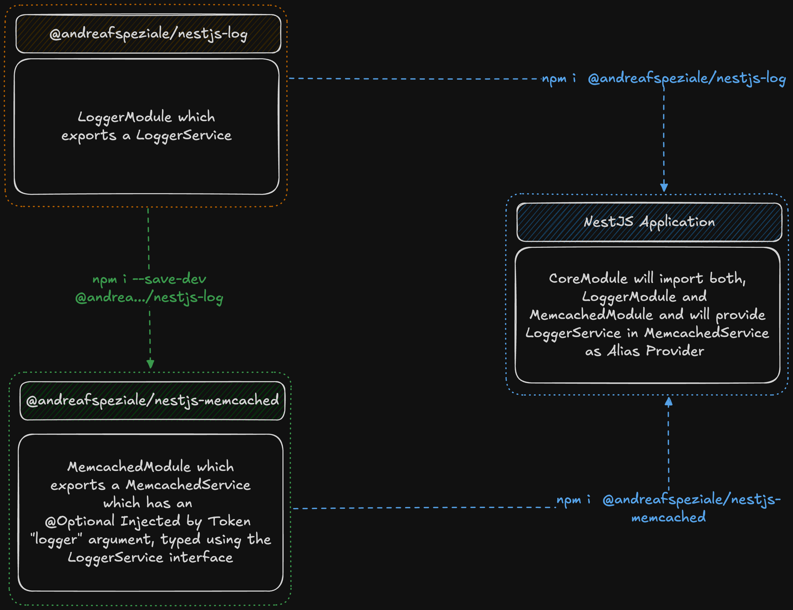

<div align="center">
  <p>
    <!-- <a href="https://memcached.org/" target="blank">
      
    </a> -->
    
    <b></b>
    <!-- <a href="https://nestjs.com/" target="blank">
      
    </a> -->
    
  </p>
  <p>
    <a href="https://memcached.org/" target="blank">Memcached</a> module and service for <a href="https://github.com/nestjs/nest" target="blank">Nest</a>,<br>
    a progressive Node.js framework for building efficient and scalable server-side applications.
  </p>
  <p>
    <a href="https://www.npmjs.com/@andreafspeziale/nestjs-memcached" target="_blank"></a>
    <a href="https://www.npmjs.com/@andreafspeziale/nestjs-memcached" target="_blank"></a>
    <a href="https://github.com/andreafspeziale/nestjs-memcached/actions" target="_blank"></a>
  <p>
</div>

## Installation

### npm

```sh
npm install @andreafspeziale/nestjs-memcached
```

### yarn

```sh
yarn add @andreafspeziale/nestjs-memcached
```

### pnpm

```sh
pnpm add @andreafspeziale/nestjs-memcached
```

## How to use?

### Module

The module is <a href="https://docs.nestjs.com/modules#global-modules" target="blank">Global</a> by default.

#### MemcachedModule.forRoot(options)

`src/core/core.module.ts`

```ts
import { Module } from '@nestjs/common';
import { MemcachedModule } from '@andreafspeziale/nestjs-memcached';

@Module({
  imports: [
    MemcachedModule.forRoot({
      connections: [
        {
          host: 'localhost',
          port: '11211',
        },
      ],
      ttl: 60,
      ttr: 30,
      superjson: true,
      keyProcessor: (key) => `prefix_${key}`,
      wrapperProcessor: ({ value, ttl, ttr }) => ({
        content: value,
        ttl,
        ...(ttr ? { ttr } : {}),
        createdAt: new Date(),
      }),
      log: true,
    }),
  ],
  ....
})
export class CoreModule {}
```

- For signle connection you can omit the `connections` property
- For multiple connections you can omit the `port` property if the server is using the default one
- `ttl` is the global time to live
- `ttr` is the global optional time to refresh
- Typically when caching a JS object like `Date` you will get back a `string` from the cache, [superjson](https://github.com/blitz-js/superjson) will `stringify` on cache `sets` adding metadata in order to later `parse` on cache `gets` and retrieve the initial "raw" data
- `keyProcessor` is the global optional key processor function which process your cache keys
- `wrapperProcessor` is the global optional wrapper processor function which wraps the value to be cached and adds metadata
- `log` enable or disable logging (`LoggerService` must be provided, check Extra Providers section)

#### MemcachedModule.forRootAsync(options)

`src/core/core.module.ts`

```ts
import { Module } from '@nestjs/common';
import { ConfigModule, ConfigService } from '@nestjs/config';
import { MemcachedModule } from '@andreafspeziale/nestjs-memcached';
import { Config } from './config';

@Module({
  imports: [
    ConfigModule.forRoot({
      ....
    }),
    MemcachedModule.forRootAsync({
      useFactory: (cs: ConfigService<Config, true>) => cs.get<ConfigService['memcached']>('memcached'),
      inject: [ConfigService],
    }),
  ],
  ....
})
export class CoreModule {}
```

### Decorators

> use the client and create your own service

#### InjectMemcachedOptions() and InjectMemcached()

`src/samples/samples.service.ts`

```ts
import { Injectable } from '@nestjs/common';
import {
  InjectMemcachedOptions,
  InjectMemcached,
  MemcachedClient,
  MemcachedModuleOptions,
  MemcachedClient
} from '@andreafspeziale/nestjs-memcached';

@Injectable()
export class SamplesService {
  constructor(
    @InjectMemcachedOptions()
    private readonly memcachedModuleOptions: MemcachedModuleOptions, // Showcase purposes
    @InjectMemcached() private readonly memcachedClient: MemcachedClient
  ) {}

  ....
}
```

### Service

> out of the box service with a set of features

#### MemcachedService

`src/samples/samples.facade.ts`

```ts
import { MemcachedService } from '@andreafspeziale/nestjs-memcached';
import { SampleReturnType } from './samples.interfaces'

@Injectable()
export class SamplesFacade {
  constructor(
    private readonly memcachedService: MemcachedService,
  ) {}

  async sampleMethod(): Promise<SampleReturnType> {
    const cachedItem = await this.memcachedService.get<string>('key');

    if(cachedItem === null) {
      ....
      await this.memcachedService.set<string>('key', 'value');
      ....
    }
  }
}
```

You can also set all the proper `Processors` and `CachingOptions` inline in order to override the global values specified during the `MemcachedModule` import

```ts
await this.memcachedService.set<string>('key', 'value', { ttl: 100 });
```

The exported `MemcachedService` is an opinionated wrapper around [memcached](https://github.com/3rd-Eden/memcached#readme) trying to be unopinionated as much as possibile at the same time.

`setWithMeta` enables `refresh-ahead` cache pattern in order to let you add a logical expiration called `ttr (time to refresh)` to the cached data and more.

So each time you get some cached data it will contain additional properties in order to help you decide whatever business logic needs to be applied.

### Health

I usually expose an `/healthz` controller from my microservices in order to check third parties connection.

#### HealthController

`src/health/health.controller.ts`

```ts
import { Controller, Get } from '@nestjs/common';
import {
  HealthCheckService,
  HealthCheckResult,
  HealthIndicatorResult,
  MicroserviceHealthIndicator,
} from '@nestjs/terminus';
import { Transport } from '@nestjs/microservices';
import { Config } from '../config';
import { ConfigService } from '@nestjs/config';

@Controller('healthz')
export class HealthController {
  constructor(
    private readonly health: HealthCheckService,
    private readonly microservice: MicroserviceHealthIndicator,
    private readonly cs: ConfigService<Config, true>,
  ) {}

  @Get()
  check(): Promise<HealthCheckResult> {
    return this.health.check([
      (): Promise<HealthIndicatorResult> =>
        this.microservice.pingCheck('memcached', {
          transport: Transport.TCP,
          options: {
            host: this.cs.get<Config['memcached']>('memcached').connections?.[0].host,
            port: this.cs.get<Config['memcached']>('memcached').connections?.[0].port,
          },
        }),
    ]);
  }
}
```

### Validation

As mentioned above I usually init my `DynamicModules` injecting the `ConfigService` exposed by the `ConfigModule` (`@nestjs/config` package). This is where I validate my environment variables using a schema validator of my choice, so far I tried `joi`, `class-validator` and `zod`.

This is an example using `joi` but you should tailor it based on your needs, starting by defining a `Config` interface:

`src/config/config.interfaces.ts`

```ts
import {
  BaseWrapper,
  MemcachedConfig,
} from '@andreafspeziale/nestjs-memcached';


/**
 * Cached data shape leveraging metadata feature
 * {
 *   content: T;
 *   ttl: number;
 *   ttr?: number;
 *   version: number;
 *   created: Date;
 * }
 */
export interface CachedMetaConfig {
  version: number;
  created: Date;
}

export type Cached<T = unknown> = BaseWrapper<T> & CachedMetaConfig;

export type Config = .... & MemcachedConfig<unknown, Cached>;
```

`src/config/config.schema.ts`

```ts
import {
  MEMCACHED_HOST,
  MEMCACHED_PORT,
  MEMCACHED_TTL,
  MEMCACHED_TTR,
  MEMCACHED_VERSION
} from '@andreafspeziale/nestjs-memcached';
import {
  MEMCACHED_PREFIX
} from './config.defaults';

const BASE_SCHEMA = ....;

const MEMCACHED_SCHEMA = Joi.object({
  MEMCACHED_HOST: Joi.string().default(MEMCACHED_HOST),
  MEMCACHED_PORT: Joi.number().default(MEMCACHED_PORT),
  MEMCACHED_TTL: Joi.number().default(MEMCACHED_TTL),
  MEMCACHED_TTR: Joi.number().less(Joi.ref('MEMCACHED_TTL')).default(MEMCACHED_TTR),
  MEMCACHED_PREFIX: Joi.string().default(MEMCACHED_PREFIX),
  MEMCACHED_VERSION: Joi.number().default(MEMCACHED_VERSION),
});

export const envSchema = Joi.object()
  .concat(BASE_SCHEMA);
  .concat(MEMCACHED_SCHEMA)
```

`src/config/index.ts`

```ts
import { Config } from './config.interfaces';

export * from './config.interfaces';
export * from './config.schema';

export default (): Config => ({
  ....,
  memcached: {
    connections: [
      {
        host: process.env.MEMCACHED_HOST,
        port: parseInt(process.env.MEMCACHED_PORT, 10),
      },
    ],
    ttl: parseInt(process.env.MEMCACHED_TTL, 10),
    ...(process.env.MEMCACHED_TTR ? { ttr: parseInt(process.env.MEMCACHED_TTR, 10) } : {}),
    wrapperProcessor: ({ value, ttl, ttr }) => ({
      content: value,
      ttl,
      ...(ttr ? { ttr } : {}),
      version: parseInt(process.env.MEMCACHED_VERSION, 10),
      created: new Date(),
    }),
    keyProcessor: (key: string) =>
      `${process.env.MEMCACHED_PREFIX}::V${process.env.MEMCACHED_VERSION}::${key}`,
  },
});
```

`src/core/core.module.ts`

```ts
import { ConfigModule, ConfigService } from '@nestjs/config';
import { MemcachedModule } from '@andreafspeziale/nestjs-memcached';
import config, { envSchema, Config } from '../config';

@Module({
  imports: [
    ConfigModule.forRoot({
      isGlobal: true,
      load: [config],
      validationSchema: envSchema,
    }),
    MemcachedModule.forRootAsync({
      useFactory: (cs: ConfigService<Config, true>) => cs.get<Config['memcached']>('memcached'),
      inject: [ConfigService],
    }),
    ....
  ],
})
export class CoreModule {}
```

`src/users/users.facade.ts`

```ts
import { MemcachedService } from '@andreafspeziale/nestjs-memcached';
import { Cached } from '../config';
import { User } from './users.interfaces'

@Injectable()
export class UsersFacade {
  constructor(
    private readonly usersService: UsersService,
    private readonly memcachedService: MemcachedService
  ) {}

  async getUser(id: string): Promise<User> {
    const cachedUser = await this.memcachedService.get<Cached<User>(
      id, { superjson: true }
    );

    /**
     * Cached data shape leveraging metadata feature
     * {
     *   content: User;
     *   ttl: number;
     *   ttr?: number;
     *   version: number;
     *   created: Date;
     * }
     */

    if(cachedItem === null) {
      ....
      await this.memcachedService.setWithMeta<User, Cached<User>>(
        id, user, { superjson: true }
      );
      ....

      return user;
    }

    return cachedUser.content;
}
```

### Extra Providers

This is one of the most recent additions.

I was looking for a nice way to introduce logging after I created and published the `nestjs-log` [npm package](https://www.npmjs.com/package/@andreafspeziale/nestjs-log).

My thoughts were:

- `nestjs-log`
  - can be declared as _peerDependency_ and be installed as _devDependency_ of consumer packages which may need logging
  - can be installed as _dependency_ of applications which will need logging for sure
- `nestjs-memcached`
  - can be a `nestjs-log` consumer
  - can be installed as _dependency_ of applications (or even packages, why not?) which will need caching
- `application` which can install both the above packages and orchestrate everything like configs and Providers DI

A visual representation can be

<div align="center">
  <p>
    
  </p>
</div>

In terms of code, in `nestjs-memcached` itself:

```ts
import { Injectable, Optional } from '@nestjs/common';
import { LoggerService } from '@andreafspeziale/nestjs-log';
import {
  InjectMemcachedOptions,
  InjectMemcached,
  InjectMemcachedLogger,
} from './memcached.decorators';
....

@Injectable()
export class MemcachedService {
  ....
  constructor(
    @InjectMemcachedOptions()
    private readonly memcachedModuleOptions: MemcachedModuleOptions,
    @InjectMemcached() private readonly memcachedClient: MemcachedClient,
    @Optional()
    @InjectMemcachedLogger()
    private readonly logger?: LoggerService,
  ) {
    this.memcachedModuleOptions.log && this.logger?.setContext(MemcachedService.name);

    ....
  }
}
```

In your application:

`src/core/core.module.ts`

```ts
import { ConfigModule, ConfigService } from '@nestjs/config';
import { LoggerModule, LoggerService } from '@andreafspeziale/nestjs-log';
import { getMemcachedLoggerToken, MemcachedModule } from '@andreafspeziale/nestjs-memcached';
import config, { envSchema, Config } from '../config';

@Module({
  imports: [
    ConfigModule.forRoot({
      isGlobal: true,
      load: [config],
      validationSchema: envSchema,
    }),
    LoggerModule.forRootAsync({
      useFactory: (cs: ConfigService<Config, true>) => cs.get<Config['logger']>('logger'),
      inject: [ConfigService],
    }),
    MemcachedModule.forRootAsync({
      useFactory: (cs: ConfigService<Config, true>) => cs.get<Config['memcached']>('memcached'),
      inject: [ConfigService],
      extraProviders: [{ provide: getMemcachedLoggerToken(), useExisting: LoggerService }],
    }),
    ....
  ],
})
export class CoreModule {}
```

The above `extraProviders` option is optional and the actual logging is driven by:

- the application logger level configured within the `LoggerModule`
- the `MemcachedModule` `log` configuration key

## Test

- `docker compose -f compose-test.yaml up -d`
- `pnpm test`

## Stay in touch

- Author - [Andrea Francesco Speziale](https://twitter.com/andreafspeziale)
- Website - [https://nestjs.com](https://nestjs.com/)
- Twitter - [@nestframework](https://twitter.com/nestframework)

## License

nestjs-memcached [MIT licensed](LICENSE).
